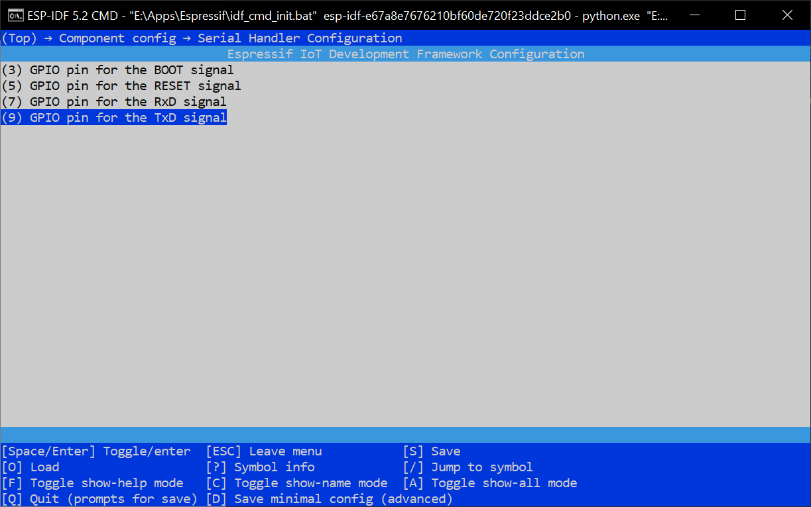
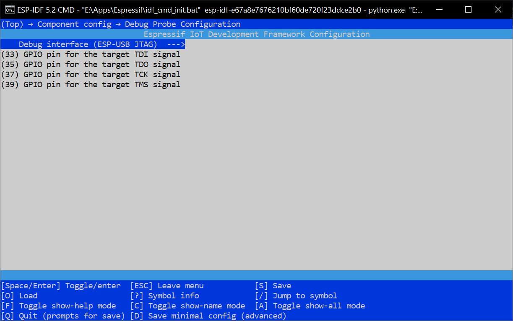
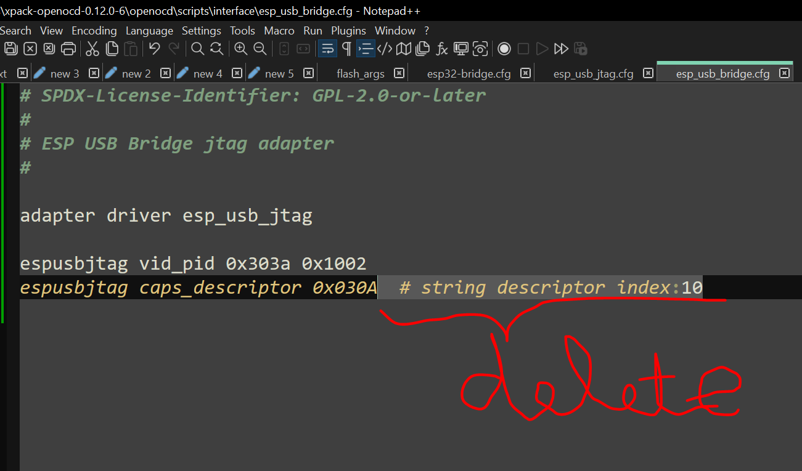
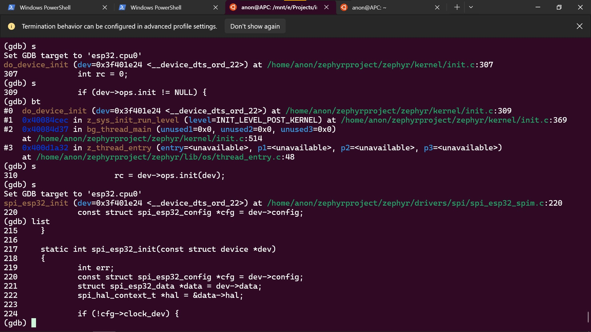
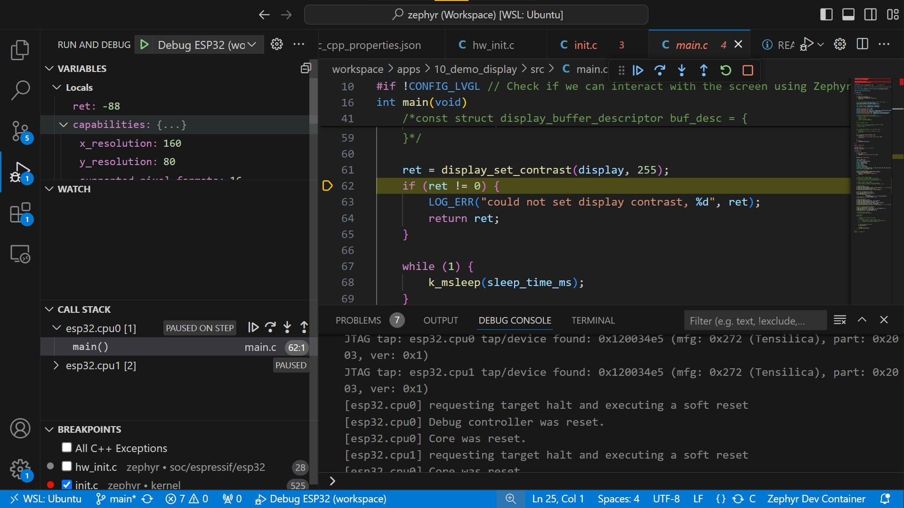
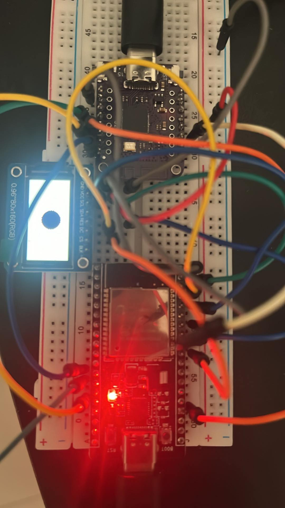

# Introduction to Zephyr - An Adaptation to ESP32

This fork is my personal learning journey to learn Zephyr RTOS following [this series](https://www.youtube.com/watch?v=mTJ_vKlMS_4&list=PLEBQazB0HUyTmK2zdwhaf8bLwuEaDH-52&index=1).

Here I adapted the course to the older [ESP32 DevKitC](https://docs.espressif.com/projects/esp-dev-kits/en/latest/esp32/esp32-devkitc/index.html) featuring an ESP-WROOM-32 instead of the S3. I am also using the latest Zephyr (4.1.0 as of this writing).

## Recommended Environment on Windows

On Windows, I found Docker and the VSCode inside it to be veryly slow. Building the container image also take a lot more time than working directly with WSL2. So my setup includes only

 * [WSL 2](https://learn.microsoft.com/en-us/windows/wsl/install) to install Zephyr and build
 * [Python](https://www.python.org/downloads/) to flash firmware

Just follow [the official instruction](https://docs.zephyrproject.org/latest/develop/getting_started/index.html) for Windows.

I also keep this repo outside of WSL file system to easily edit the code using *VSCode on my host Windows machine*
```
cd E:\Projects\
git clone git@github.com:light-tech/introduction-to-zephyr-esp32.git
```

Then inside this clone repo, create a Python virtual environment to install flashing tools
```bat
# Set-ExecutionPolicy -Scope CurrentUser -ExecutionPolicy Unrestricted -Force

cd E:\Projects\introduction-to-zephyr-esp32
python -m venv venv
venv\Scripts\activate
python -m pip install pyserial==3.5 esptool==4.8.1
```

Some useful VSCode extensions:

 1. [WSL]() that allows you to open WSL folder with your native VSCode so that you can browse the files in the Zephyr installation inside WSL
 2. [nRF DeviceTree](https://marketplace.visualstudio.com/items?itemName=nordic-semiconductor.nrf-devicetree) for syntax highlight of device tree files
 3. [C/C++]() to do gdb step through debugging graphically

## Build Application

Open WSL terminal and first do
```
source $HOME/zephyrproject/.venv/bin/activate
source $HOME/zephyrproject/zephyr/zephyr-env.sh
export ZEPHYR_TOOLCHAIN_VARIANT=zephyr
export ZEPHYR_SDK_INSTALL_DIR=$HOME/zephyr-sdk-0.17.0
echo "Zephyr base: $ZEPHYR_BASE"
```
to set up the Zephyr build environment. (You can put this in your WSL `.bashrc` to have this always run on startup. Of course, adapt the paths depending on how you install Zephyr. The two `export` commands are just to speed up SDKs discovery; otherwise it will take longer to build.)

Now go find your repository on the host machine:
```
cd /mnt/e/Projects/introduction-to-zephyr-esp32/workspace/apps/01_demo_blink
west build -p always -b esp32_devkitc_wroom/esp32/procpu -- -DDTC_OVERLAY_FILE=boards/esp32s3_devkitc.overlay
```

## Flash Application

You may need to install USB drivers for your development boards which could be [CP210x](https://www.silabs.com/developers/usb-to-uart-bridge-vcp-drivers?tab=downloads) or [WCH340G](). Without this you cannot upload code or debug.

Open Powershell on the **host computer**, activate the Python virtual environment on which we installed the flashing tools earlier by running
```
cd E:\Projects\introduction-to-zephyr-esp32
.\venv\Scripts\activate
```

Now we can do
```sh
python -m esptool --port "<PORT>" --chip auto --baud 921600 --before default_reset --after hard_reset write_flash -u --flash_mode keep --flash_freq 40m --flash_size detect 0x1000 workspace/apps/01_demo_blink/build/zephyr/zephyr.bin
```
where `<PORT>` should be the COM port of your ESP32 DevKit assigned by Windows (check it in Device Manager). If you wonder how we find this command, try out `west flash` in WSL. Note [the subtle address difference](https://developer.espressif.com/blog/esp32-bootstrapping/) `0x1000` here instead of `0x0` in the ESP32-S3!

It there is flashing error, you can try reset the device into bootloader mode by holding the *BOOT* button and pressing and releasing the *RESET* button and finally release the *BOOT* button.

## Serial Monitor

Run this

```sh
python -m serial.tools.miniterm "<PORT>" 115200
```

## Step Through Debugging

Unlike the S3 DevKit, the ESP32 does not come with JTAG debugging port so we won't be able to follow [Part 7](https://www.youtube.com/watch?v=XGTtMYa7IiM&list=PLEBQazB0HUyTmK2zdwhaf8bLwuEaDH-52&index=7) [as is](https://www.digikey.com/en/maker/tutorials/2025/introduction-to-zephyr-part-7-debugging-with-openocd-and-gdb). Several alternatives using the similar FT2322H as the official [ESP-Prog](https://docs.espressif.com/projects/esp-iot-solution/en/latest/hw-reference/ESP-Prog_guide.html) are suggested at https://medium.com/@manuel.bl/low-cost-esp32-in-circuit-debugging-dbbee39e508b but unlike the article, I found that they are _as expensive as_ the ESP-Prog and the unit I got never run.

Luckily, I found yet another alternative here https://medium.com/@mjyai/debugging-esp32-using-2-s2-mini-via-jtag-5e9fccc1ff5b.
The [S2 Mini](https://www.wemos.cc/en/latest/s2/s2_mini.html) is still cheap as of this writing. The article is for PlatformIO so we need to adapt to Zephyr.

### The debugger firmware

If you don't mind installing the entire ESP-IDF, you can clone the [esp-usb-bridge](https://github.com/espressif/esp-usb-bridge) project and follow [the instruction](https://github.com/espressif/esp-usb-bridge?tab=readme-ov-file#how-to-compile-the-project) to build and flash it to the S2 Mini.

To save time, I also have the prebuilt firmware [here](https://github.com/light-tech/introduction-to-zephyr-esp32/releases/download/v1.1.0/esp-usb-bridge-1.1.0.zip). With it, simply run
```
python -m esptool --chip esp32s2 -b 460800 --before default_reset --after hard_reset write_flash --flash_mode dio --flash_size 2MB --flash_freq 80m 0x1000 build\bootloader\bootloader.bin 0x8000 build\partition_table\partition-table.bin 0x10000 build\bridge.bin
```
to flash, just like Zephyr application. No extra tool required. (You may need to put the device into bootloader mode first. When I got the unit, plugging into the USB did not do anything and the LED did not light up so I thought it was dead. But then I pressed both buttons, released them and the COM port showed up in my computer.)

I kept Espressif's VID and PID to avoid changing OpenOCD configuration. For the GPIO choice, I purposely used the outer pins of the S2 Mini so that you can simply solder the two outer headers and can use it on the breadboad




The instruction following will assume this pin selection. In case you compile the firmware yourself, please adapt to your own config.

If you see
```
Error: ESP32-S2FNR2 (revision v1.0) chip was placed into download mode using GPIO0.
esptool.py can not exit the download mode over USB. To run the app, reset the chip manually.
To suppress this note, set --after option to 'no_reset'.
```
then worry not. As long as the
```
Hash of data verified.
```
are printed out, we are fine. Just press the `RST` button on the S2 Mini to manually reset it and run the debugger firmware we just flash.

### Connection

Now we can connect

| JTAG pin | S2 Mini  | ESP32    |
| :------- | :------: | -------: |
| TDI      | 33       | 12       |
| TDO      | 35       | 15       |
| TCK      | 37       | 13       |
| TMS      | 39       | 14       |
| RST      | 5        | EN       |
|          | GND      | GND      |

(Refer to the above image for the pin selection in the firmware.)

### OpenOCD fix

After downloading and extracting [openocd](https://openocd.org/), we need to fix a configuration file for it to work.
Open the file `openocd/scripts/interface/esp_usb_bridge.cfg` and delete the part after the `#` sign on the line
```
espusbjtag caps_descriptor 0x030A  # string descriptor index:10
```
so it should read
```
espusbjtag caps_descriptor 0x030A
```
These config files are not shell scripts and do not accept line comments like that.



### Running OpenOCD

Now we can finally run

```
openocd -f board/esp32-bridge.cfg -c "bindto 0.0.0.0"
```

and continue with the episode

```
$ZEPHYR_SDK_INSTALL_DIR/xtensa-espressif_esp32_zephyr-elf/bin/xtensa-espressif_esp32_zephyr-elf-gdb build/zephyr/zephyr.elf
```



(Note that we use `esp32` and not `esp32s3`!)

The extra command `bindto` is to instruct `openocd` to listen to all interfaces and not just localhost `127.0.0.1`. That way you can connect to it from inside WSL; otherwise, you would have to install the entire ESP GDB toolchain on the host. To get the IP address of the Windows host, follow [this](https://learn.microsoft.com/en-us/windows/wsl/networking) or simply run `ip route` in WSL and extract it from the line similar to

```
default via 172.17.240.1 dev eth0 proto kernel
```

You can try debugging with `telnet` like [this](https://github.com/wuxx/ESPLink):

```
telnet 172.17.240.1 4444
```

In the episode, remember to replace `host.docker.internal` with the IP found above. In my case, it would be

```
target extended-remote 172.17.240.1:3333
```



## LVGL

The LVGL demo application crashes for me.

Using step through debugging above, it crashes due to nested exception (some Zephyr start-up code written in assembly that is beyond me to fix) long before main function. Commented out the entire `main()` function does not fix the issue but commenting out the `#include <lvgl.h>` prevents the crash so it is definitely caused by some LVGL initialization code.

The cause of the crash could be due to initialization of the hardware as well as I do not have the same LCD module. So to start, let eliminate hardware issue by driving the common working [0.9" OLED display](https://randomnerdtutorials.com/guide-for-oled-display-with-arduino/) *without LVGL*. I found working code in [this video](https://youtu.be/ddZ-04IVrak?list=PLEQVp_6G_y4iFfemAbFsKw6tsGABarTwp)

```
west build -b esp32_devkitc_wroom/esp32/procpu -- -DDTC_OVERLAY_FILE=boards/esp32_oled.overlay -DEXTRA_CONF_FILE=boards/esp32_oled.conf
```

(I found out that the 3.3V pin from ESP32 cannot supply enough current to the screen. I need to use an external power supply for it to work.)

Next, let try to render simple shapes (rectangles, circles) on the working OLED using LVGL. (Text are complicated and heavy so let leave them.) This is where one must understand the software and Kconfig.

LGVL is implemented as a Zephyr module. It has two parts:

  * The platform dependent part is located at `zephyrproject/zephyr/modules/lvgl`. This part contains a couple of Zephyr's Kconfig for LVGL and Zephyr implementation of various system functions (memory allocation i.e. how LGVL can do `malloc`) and callback functions (render the bitmap onto the display).
  
    These are set up in `lvgl_init()` which is executed in another thread by default unless `CONFIG_LV_Z_AUTO_INIT=n`. This is what I did to debug through the initialization.
    
    Zephyr default memory allocator uses a fixed size (`CONFIG_LV_Z_MEM_POOL_SIZE` bytes) heap. Needless to say, it must be sufficiently high (`8192`) since LVGL allocates a lot of objects.

    **For the OLED display we are using**: The config `CONFIG_LV_COLOR_DEPTH_1=y` and `CONFIG_LV_Z_BITS_PER_PIXEL=1` are crucial. This let Zephyr set up the right flush callback to update the screen. Since the screen is small (its entire pixels take up only 1024 bytes), we set `CONFIG_LV_Z_BUFFER_ALLOC_STATIC=y` and
`CONFIG_LV_Z_MONOCHROME_CONVERSION_BUFFER=y` to optimally use memory.

  * The platform independent part is in `zephyrproject/modules/lib/gui/lvgl`. This is where drawing logic is implemented, the original code of the LVGL project. LVGL has its own Kconfig. For example, we choose `CONFIG_LV_CONF_MINIMAL=y` and `CONFIG_LV_USE_LINE=y` to bring in only the line drawing part of the library.

The major code changes are to call `lvgl_init` ourselves in `main`. Since the screen is monochrome, we cannot use color other than `lv_color_white()` and `lv_color_black()`. (Black is actually cyan and white is black for me.)

The next checkpoint is to get the colorful LCD working. All the hard work is done. Here I switch to `spi3` (with default pin control) as the pins for SPI2 clashes with the JTAG ones.

| ESP32     | ST7735 LCD | Extenal Power Supply |
| :-------  | :--------: | -------------------: |
| GND       | GND        | GND                  |
|           | VCC        | 3.3V                 |
| 18 (SCLK) | SCL        |                      |
| 19 (MISO) |            |                      |
| 23 (MOSI) | SDA        |                      |
| 1         | RES        |                      |
| 3         | DC         |                      |
| 5  (CSEL) | CS         |                      |
|           | BLK        |                      |

Building and flashing

```
west build -b esp32_devkitc_wroom/esp32/procpu -- -DDTC_OVERLAY_FILE=boards/esp32s3_devkitc.overlay -DEXTRA_CONF_FILE=boards/esp32s3_devkitc.conf
```

and here is my final result:



## License

All software in this repository, unless otherwise noted, is licensed under the [Apache-2.0](https://www.apache.org/licenses/LICENSE-2.0) license.
